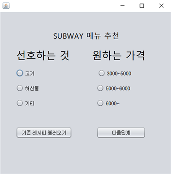
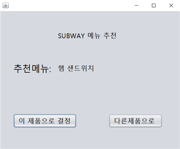
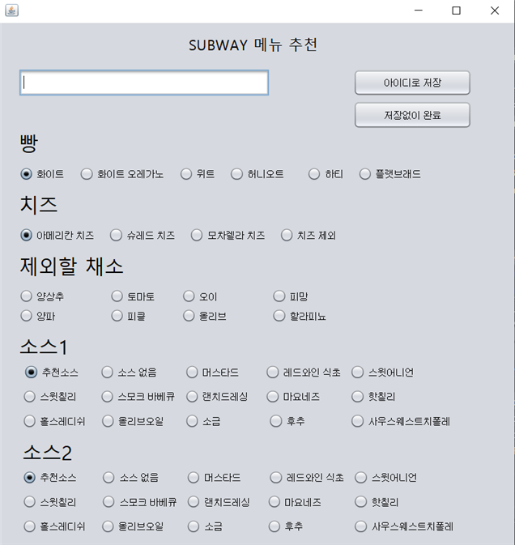
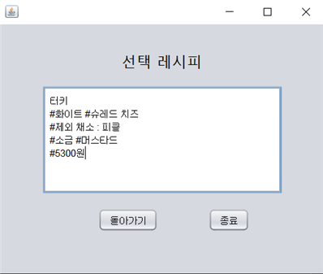
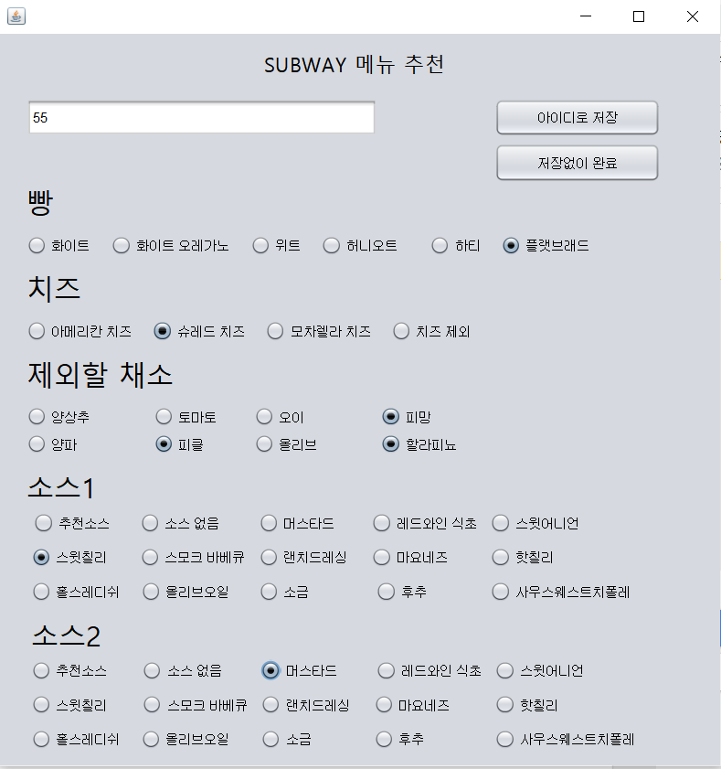
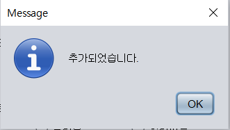
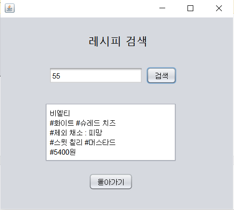
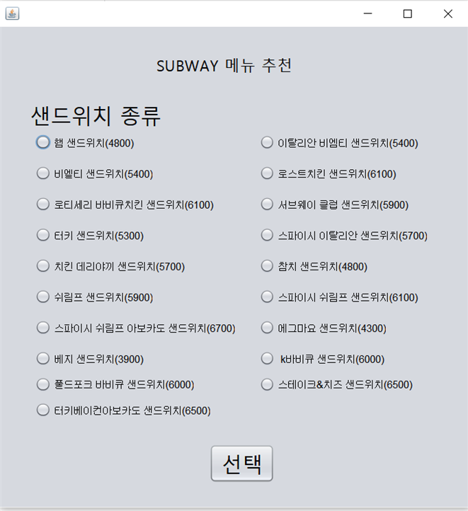

# 🥪 Subway Recommend Program

서브웨이(SUBWAY) 메뉴 선택에 어려움을 겪는 사용자를 위한 **자바 기반 Windows 응용 프로그램**입니다.
몇 가지 질문에 답하는 것만으로 취향에 맞는 메뉴 조합을 추천받고, 마음에 들지 않으면 직접 커스터마이징할 수 있습니다.

> 인하공업전문대학 컴퓨터정보과 2022년도 자바 프로젝트 수업 결과물

## 📌 프로젝트 소개

대학생들은 이른 아침 강의를 듣기 위해 등교하는 경우가 많아 아침이나 점심 식사를 거르는 일이 잦고,
이런 경우 빠르게 식사를 해결할 수 있는 서브웨이를 찾는 경우가 많습니다. 하지만 서브웨이는 메뉴 구성 방식의
특성상 처음 이용하는 사람에게는 선택이 어렵게 느껴질 수 있습니다.

**Subway Recommend Program**은 이런 문제를 해결하기 위해, 질문에 답하는 방식으로 사용자에게 맞는
메뉴 조합을 추천하고 선택 시간을 단축시켜 주는 프로그램입니다.

## ✨ 주요 기능

- **질문 기반 메뉴 추천**: 몇 가지 질문에 답하면 취향에 맞는 메뉴 조합을 도출
- **커스터마이징**: 추천 결과가 마음에 들지 않을 경우 직접 세부 옵션을 수정 가능
- **ID 기반 저장/불러오기**: 완성한 조합을 ID로 저장해 두었다가, 다음에 ID만 입력하면 이전에 선택했던 조합을 다시 불러올 수 있음
- **DB 연동**: 메뉴 정보와 사용자가 저장한 레시피(조합)를 데이터베이스에 저장·관리

## 🗂 데이터베이스 구성

- `subway.menu` — 서브웨이 메뉴(빵, 소스, 야채 등) 정보 테이블
- `subway.recipe` — 사용자가 저장한 메뉴 조합(레시피) 테이블

## 🖥 사용 흐름 및 실행화면

**1. 프로그램 실행**

**2. 조건에 맞는 메뉴 추천**

선택 후 다음 단계를 클릭하면 조건에 맞는 메뉴를 추천받습니다.

**3. 세부 사항 선택**

마음에 드는 제품으로 결정하면 세부 사항을 선택할 수 있습니다.

**4. 저장 없이 완료**

세부 사항 선택 창에서 저장 없이 바로 완료할 수도 있습니다.

**5. ID로 저장**

아이디를 입력한 후 저장을 클릭하면 선택한 조합이 저장됩니다.

**6. 저장된 레시피 불러오기**

초기 화면에서 '기존 레시피 불러오기'를 클릭하고 아이디를 검색하면, 이전에 저장했던 조합을 다시 불러올 수 있습니다.

**7. 다른 메뉴 추천받기**

추천받은 후 마음에 들지 않으면 다른 제품으로 다시 추천받을 수 있습니다.

## 🛠 기술 스택

- **Language**: Java (Swing 기반 GUI)
- **Database**: RDBMS (JDBC 연동)

## 👥 팀 구성

인하공업전문대학 컴퓨터정보과 · 2022년 자바 프로젝트 (2022.08.31 ~ 2022.12.20)

| 역할 | 이름 |
| --- | --- |
| 팀장 | 김경민 |
| 팀원 | 최민주 |
